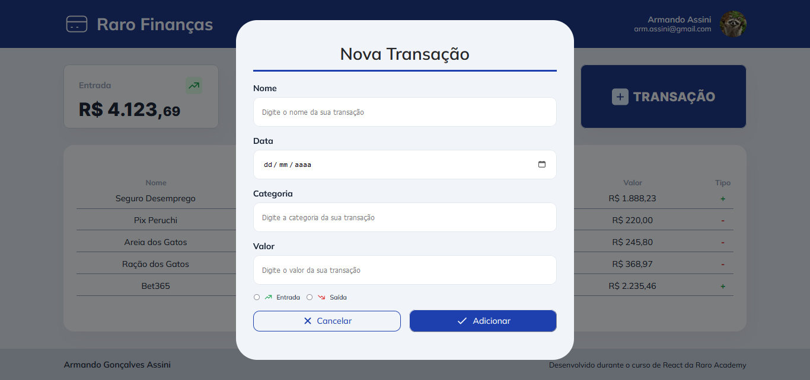

# Raro Finanças - Armando Assini

O presente projeto consiste no desenvolvimento de uma tela para inclusão de transações em uma tabela de histórico de finanças.

Todo o processo foi desenvolvido utilizando *ReactJS*.

## Começando

Para rodar o projeto é necessario clonar o repositório para seu computador e fazer as instalações mencionadas a seguir para rodá-lo em browser. Todos os browser são suportados, porém é possível que ocorram leves diferenças de visualização dependendo do software e da versão do software utilizados.

### Instalação

Por se tratar de um projeto simples, a instalação também será:

Primeiramente clone o repositório para sua máquina, utilize o método de clone que preferir:

    https://git.raroacademy.com.br/armando.assini/atividade-avaliativa-5 
    
Em seguida abra o repositório e utilize o seguinte comando para instalar as dependências do projeto:

    npm install

A partir destas instalações o projeto já estará funcional. Rodando o comando seguinte, um servidor irá abrir onde a aplicação estará rodando:

    npm run dev

No terminal será mostrado um link de onde pode ser visualizada a aplicação:

## Visão Geral do Projeto

Para a montagem do projeto foi fornecido um layout do Figma, que pode ser encontrado através do link

- [Figma Raro Finanças](https://www.figma.com/file/SmIdXRXkf9A4kOHAINlWeD/Raro-Finan%C3%A7as?node-id=0%3A1&mode=dev)

Como resultado do projeto temos:

Nesta primeira tela podemos visualizar:

 - Um Header e um Footer com informações do usuário e do projeto;
 - Informações sobre somatório de entradas, saídas e o saldo final de acordo com as transações adicionadas à tabela;
 - Um botão que permite adicionar uma nova transação à tabela. O clique do botão abre o Modal visto a seguir.

- No modal adicionamos as informações na ordem que aparecem na tabela, e formatadas para que o usuário forneça informações de maneira correta.

## Construção do Projeto

### Objetivo

Como mencionado o projeto foi todo realizado utilizando *ReactJS*.

O objetivo principal da prática era permitir os alunos a ter um maior contato com a ferramenta, focando a utilização de Estados (até o momento apenas utilizando a função *useState*), e ainda utilizar os conhecimentos adquiridos ao longo do curso. Portanto durante o desenvolvimento foram utilizados conhecimentos de *ReactJS*, *HTML*, *CSS*, e ainda do uso do *GitFlow*.

### Desenvolvimento

A partir do Figma mostrado anteriormente, foram construídos a Tela principal e o Modal, ambos utilizando do conceito de componentes.

Criados os componentes foi iniciada a fase de implementação das funcionalidades:

 - Abertura do Modal a partir do clique no botão 'Transações';
 - Recebimento das informações do Modal, formatadas;
 - Construção da tabela 'Histórico de Transações' a partir dos dados recebidos do Modal;
 - Cálculo e exibição dos valores de Entradas, Saídas e Saldo.

Todas as atualizações (ou rerenderizações) na página são por meio da função *useState*.

### Fluxo de Arquivos

Foi proposta a utilização do padrão de GitFlow da Raro durante o desenvolvimento do projeto, portanto, utilizando o GitLab foram abertas *Issues* com intuito de dividir o projeto em etapas, e para cada uma dessas etapas, foi utilizada uma *branch* de desenvolvimento. 

Ao final do desenvolvimento de cada *branch*, o mesmo é fundido a uma outra *branch* secundária, que ainda não é a principal, ou a *main*.

Finalizadas todas as *branches*, com todo o projeto finalizado, funde-se a *branch* secundária na *main* e finaliza-se o fluxo de trabalho.

O intuito da prática é fazer com que os alunos entendam o fluxo dos arquivos para que quando passem a trabalhar em equipe, esse fluxo já seja comum.

## Conclusão

Ao final do desenvolvimento o projeto está funcional, porém não apresenta total responsividade para todo tipo de aparelho.

A proposta da atividade foi seguida e o conteúdo referente ao uso da *useState* foi utilizado e compreendido.

## Possíveis Melhoras

Segue uma lista de sugestões de melhorias futuras:
- Fixar o título da tabela, assim como os títulos de cada coluna, para quando a lista de transações exceder o tamanho da página e o scroll for utilizado, essas informações se mantenham a vista durante todo o tempo;
- Implementar uma transição da abertura do Modal, para que fique mais agradável ao usuário;
- Implementar um botão de retirada de transações da tabela;
- Trabalhar na responsividade, incluindo mais *media query's* e outras melhorias;
- Incluir backend, possibilitando novas funções como usuários, histórico de transações salvo, entre outros;

## Autor

  - **Armando Assini** - *arm.assini@gmail.com*

**Contribuições** - Professores, Monitores e Colegas de classe Turma React2 - Raro Academy.
